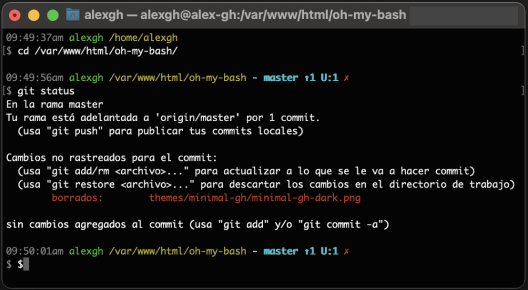

## `90210`

## `ab+simple`

## `agnoster`

## `axin`

## `bakke`

## `binaryanomaly`

## `bobby`

## `bobby-python`

## `brainy`

## `brunton`

## `candy`

## `clean`

## `cooperkid`

## `cupcake`

## `demula`

## `dos`

## `doubletime`

## `doubletime_multiline`

## `doubletime_multiline_pyonly`

## `dulcie`

## `duru`

## `edsonarios`

## `emperor`

## `envy`

## `font`

## `gallifrey`

## `half-life`

## `hawaii50`

## `iterate`

## `kitsune`

## `luan`

## `mairan`

## `mbriggs`

## `minimal`

## `minimal-gh`

## `modern`

## `modern-t`

## `morris`

## `n0qorg`

## `nwinkler`

## `nwinkler_random_colors`

## `pete`

## `powerbash10k`

## `powerline`

## `powerline-icon`

## `powerline-light`

## `powerline-multiline`

## `powerline-naked`

## `powerline-plain`

## `primer`

## `pro`

## `pure`

## `purity`

## `pzq`

## `rainbowbrite`

## `rana`

## `rjorgenson`

## `robbyrussell`

## `roderik`

## `rr`

## `sexy`

## `simple`

## `sirup`

## `slick`

## `standard`

## `tonka`

## `tonotdo`

## `tylenol`

## `vscode`

## `wanelo`

## `zitron`

## `zork`

