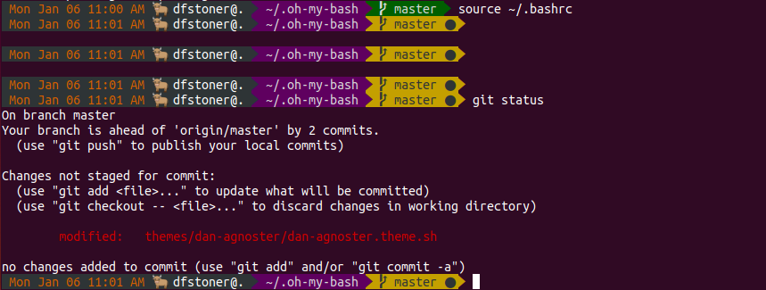

# dan-agnoster

This is a customized versinon of the `agnoster` theme.

See its README for requirements, etc.

## Additional Variables

Set these in `.bashrc` to customize the theme:

`DISABLE_UNTRACKED_FILES_DIRTY` actually works (planned).

`PROMPT_STAMPS` allow timestamp format in segement to be customized (planned).

`BLING_STRING` for blinging the status line with unicode or other.

`PROMPT_HOST_NAME` instead of system's host acquired by lookup, use this hostname.

