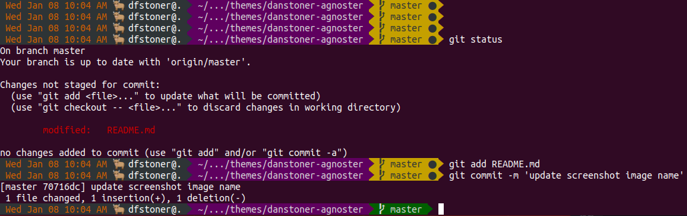

# danstoner-agnoster

This is a customized versinon of the `agnoster` theme.

At a minimum you will need:

1. a powerline-patched font
* These can be acquired from: https://github.com/powerline/fonts.git

2. a terminal configured to use one of those powerline fonts

See the agnoster theme's README for more info.

## Additional Variables

In addition to the `agnoster` standard customizations, set these in `.bashrc` to customize this theme:

`BLING_STRING` for blinging the status line with a unicode or other message.

Future potential work on this theme:

`DISABLE_UNTRACKED_FILES_DIRTY` actually works (TODO).

`PROMPT_STAMPS` allow timestamp format in segment to be customized instead of hard-coded (TODO).

`PROMPT_HOST_NAME` instead of system's host acquired by lookup or hard-coded, use this hostname (TODO)

