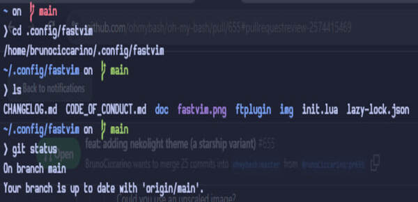

# NekoLight prompt theme

Nekolight is an Oh-My-Bash prompt theme inspired by Starship and designed to be simple and lightweight.



## 🚀 Installation

Prerequisites
- A Nerd Font or Powerline Font installed and enabled in your terminal (for example, try the FiraCode Nerd Font).

After installing the Nerd Fonts font, just modify the following line in your ~/.bashrc

```shell
OSH_THEME="nekolight"
```

and then to load the theme in your terminal you must type `source ~/.bashrc`.
